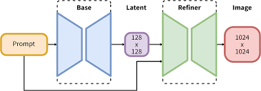

# SimpleSDXL
This repository contains a simple and flexible PyTorch implementation of [StableDiffusion-XL](https://stability.ai/stable-image) based on diffusers.

<div align="center">
   
</div>

## Prepartion
- You should download the checkpoints of SDXL-base, from [SDXL-base](https://huggingface.co/stabilityai/stable-diffusion-xl-base-1.0) and SDXL-refiner, from [SDXL-refiner](https://huggingface.co/stabilityai/stable-diffusion-xl-refiner-1.0), including scheduler, text_encoder_1, text_encoder_2, tokenizer, tokenizer_2, unet, and vae. Then put it in the ckpt folder.
- We recommend you to use git-lfs to download the huggingface checkpoint directly via:
```
yum install git-lfs
git lfs install
git clone https://huggingface.co/stabilityai/stable-diffusion-xl-base-1.0
git clone https://huggingface.co/stabilityai/stable-diffusion-xl-refiner-1.0
```

## Requirements
- Python >= 3.8 (Recommend to use [Anaconda](https://www.anaconda.com/download/#linux) or [Miniconda](https://docs.conda.io/en/latest/miniconda.html))
- [PyTorch >= 1.12](https://pytorch.org/)
- xformers == 0.0.13
- diffusers == 0.13.1
- accelerate == 0.17.1
- transformers == 4.27.4

A suitable [conda](https://conda.io/) environment named `ldm` can be created
and activated with:

```
conda env create -f environment.yaml
conda activate ldm
```

## Dataset Preparation
- You need write a DataLoader suitable for your own Dataset, because we just provide a simple example to test the code.

## Training
```
CUDA_VISIBLE_DEVICES=0 python train.py
CUDA_VISIBLE_DEVICES=0,1,2 accelerate launch --multi_gpu train.py
```

## Inference
```
CUDA_VISIBLE_DEVICES=0 python inference.py --prompt "A cat is running in the rain."
```

## TODO
- [x] Base Model Training & Inference Code
- [ ] (Soon) Refiner Model Training & Inference Code
- [ ] (Soon) Fix Bugs such as mixed-precision
- [ ] (Soon) Fix Other Bugs

## Acknowledgements
Many thanks to the code bases from [diffusers](https://github.com/huggingface/diffusers) and [SimpleSDM](https://github.com/haoningwu3639/SimpleSDM).
